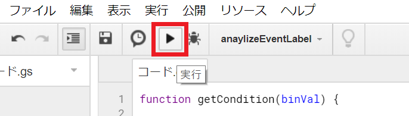

## Googleアナリティクス イベントトラッキング集計結果の解析スクリプトについて

保育園/幼稚園マップの検索から実行された絞り込み条件をGoogleアナリティクス(GA)で集計しています。
<br>
集計値の解析にGoogle Apps Scriptを使用します。
<br>


### 集計/解析の流れ

+ 検索の実行時に絞り込み条件によってユニークな数値を生成しGAのイベントラベルとして送信

+ GAでイベントの集計をイベントラベルでグループ化してGoogleスプレッドシートとしてエクスポート

+ Google Apps scriptを実行してユニークな数値から元の絞り込み条件をスプレッドシートに書き出し
<br>

### 手順

<h6>※GAのCodeforKohokuアカウントにログインした前提とします。
<br>
手順は一部の確認画面等の省略がり、また環境によって追加の設定などが必要な可能性があります。
</h6>

<br>

GA画面左のパネルで「行動」->「イベント」-> 「概要」と選択します。
<br><br>

<br>

画面下部の「イベントカテゴリ」にある「filter」を選択します。


画面下部の集計表のグループ化(プライマリ ディメンション)で「イベントラベル」を選択します。
<br>
イベントラベル(絞り込み条件ごとの数値)でグループ化されます。
<br><br>


画面上部右の「エクスポート」から「Google スプレッドシート」を選択します。


通常であればWEBブラウザでエクスポートされたスプレッドシートが開かれます。
<br>
イベントラベルに基づいた集計結果が確認できます。
<br>


スプレッドシートのメニューの「ツール」から「スクリプト エディタ」を選択します。
<br>
※エディタを初めて開く場合は初期設定が表示される可能性があります。
<br><br>


エディタが開くと初回であれば新規スクリプトファイル(コード.gs)が開きます。
<br>
ファイルには以下のようにデフォルトの空の関数が表示されます。
```
function myFunction() {

}
```

※過去にエディタ上で作業していたファイルが表示された場合は
<br>
メニューの「ファイル」-> 「新規作成」->「スクリプト ファイル」と選択してください。
<br>
___
githubリポジトリ(ga_event_tools)にある「event_label_parser.gs」ファイルを開きます。
<br>
ファイルの中身をすべてコピーしてエディタ上の新規スクリプトファイルに貼り付けます。
<br>
※デフォルトの「function myFunction() {..}」は削除してください。

<br>


貼り付けが完了したらファイルを保存します。 メニューの「ファイル」->「保存」 / または「Ctrl + S」
<br><br>
保存が完了したら、メニューの「実行」->「関数を実行」->「analyzeEventLabel」と選択します。
<br>
これによりスクリプト実行時に呼び出す関数が「analyzeEventLabel」になります。
<br><br>

<br>
スクリプトを実行してスプレッドシート上のイベントラベルの数値を解析して結果を出力します。
<br>
メニュー下のアイコンの中から「▶」を選択します。
<br>
<h6>
※実行時にエクスポートしたイベントラベル集計のシートがアクティブになっていることを確認してください。
<br>
　アクティブなシートに値が「イベント ラベル」のセルがない場合はメッセージが表示され実行されません。
<br>
　またエクスポートしたシート以外で値が「イベント ラベル」のセルを含む場合はスクリプトは実行されますが、
<br>
　書き込みはシート内に既に値が入力されている範囲より右側の列にされますので、既にあるデータが上書きされる心配はありません。
</h6>


スクリプトが正常に終了するとイベントラベルの数値を二進数へ変換した値と元の絞り込み条件が書き込まれます。
<br>


以上までが手順になります。
<br>
<h6>
※スクリプトの初版として書き込みの上述したフォーマットとしてますが、より複雑な解析や書き出しへ修正が可能です。
</h6>
